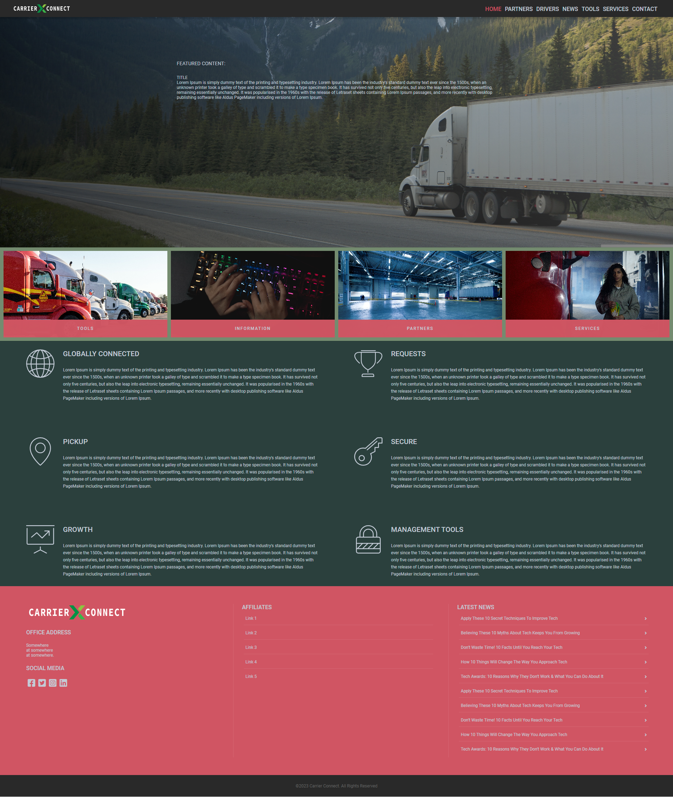
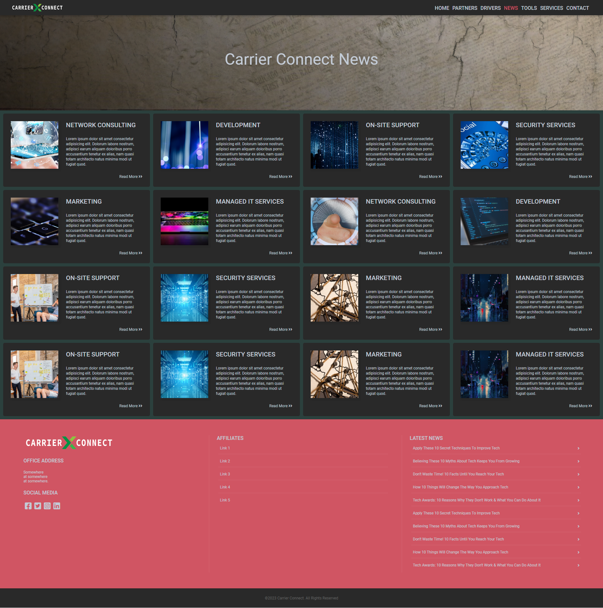

# WIP: Carrier Connect

## Inspiration

The idea of connecting empty trucks with cargo going to the same destination city is an inspiring project that has the potential to make a significant impact on the transportation industry. Utilizing this project can help reduce transportation costs, decrease carbon emissions, and increase efficiency. The inspiration behind this project comes from the realization that there are a significant number of empty trucks driving on the roads, By creating a platform that connects these two parties, this project has the potential to create a win-win situation for both trucking companies and cargo owners, while also benefiting the environment

## What it does

The project connects trucking companies and cargo owners through an online platform that matches empty trucks with available cargo going in the same direction, reducing the number of empty trucks on the road and optimizing the use of resources. This project helps to reduce transportation costs, increase efficiency, and decrease carbon emissions by eliminating the need for additional trucks to transport the same cargo. This project has the potential to revolutionize the way transportation is done, and it serves as an excellent example of how innovation and inspiration can lead to impactful solutions.

## How we built it

The project was created using angular, c#, twilio, cohere, tauri 

## What's next for CarrierConnect

A fully functional mobile app would be our next move.

